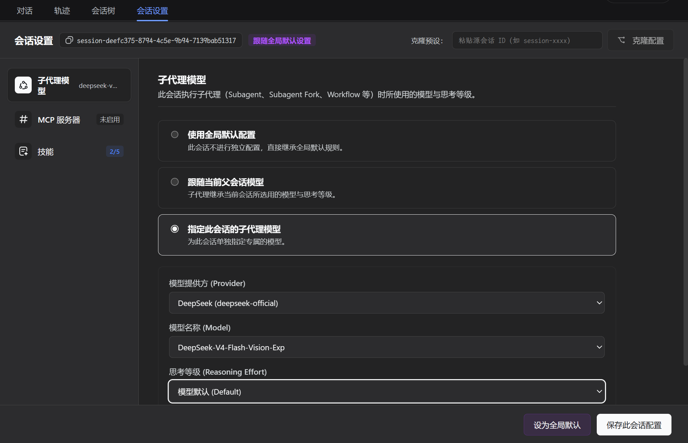
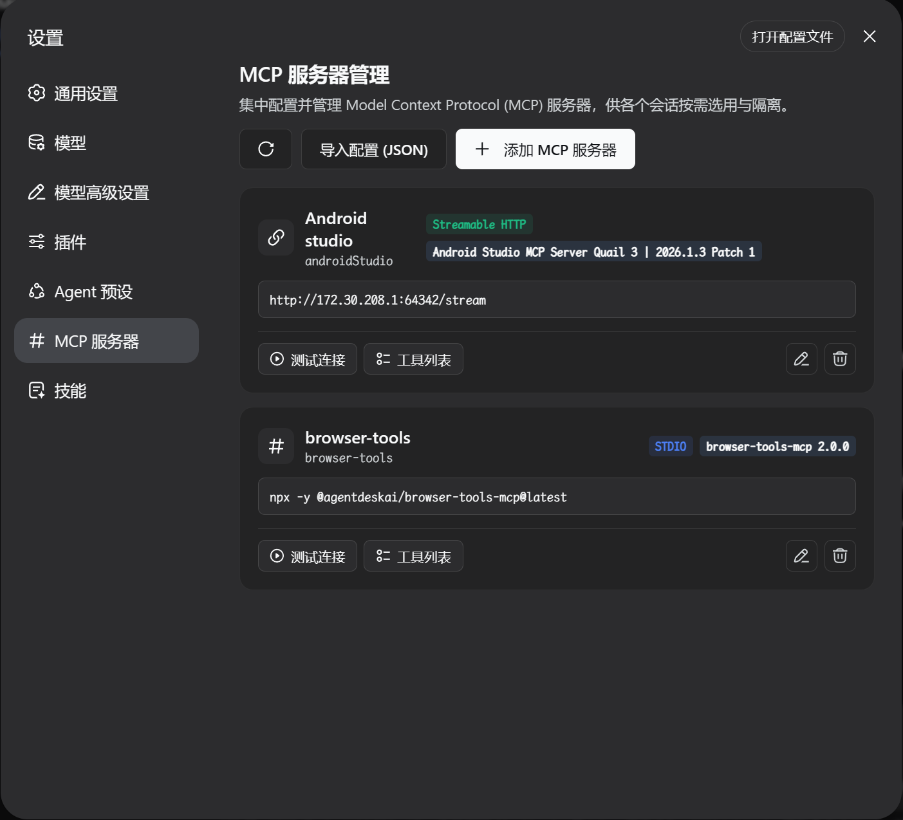
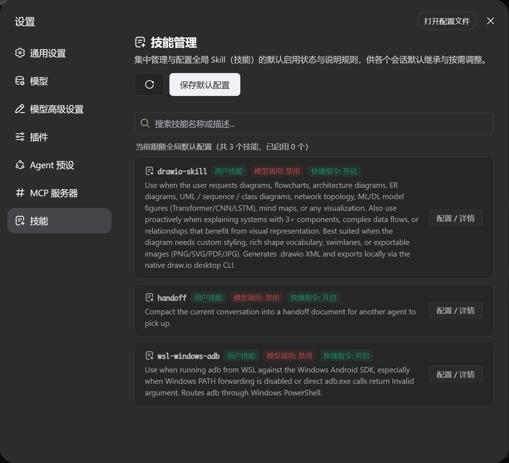

# dsh-session-settings

English | [中文](README.zh.md)

**Session Settings, MCP Server, and Skill Management plugin for DeepSeek Harness (DSH) Web GUI.**

Configure per-session or global settings directly from the Web GUI with immediate effect:
1. **Subagent Model & Reasoning Effort**: Independently configure provider, model, and reasoning effort for subagents (`subagent`, `subagent_fork`, `workflow`).
2. **Centralized MCP Server Management**: First-class sidebar navigation item for Model Context Protocol (MCP) servers with 2-stage compatibility probing, automatic protocol downgrade, and tool schema inspection.
3. **Session-Level MCP Tool Control**: Granularly enable/disable MCP servers and specific tools per session or follow global defaults.
4. **Session-Level Skill Management & Control**: Independently enable/disable bundled, user, and project skills per session, with automatic dynamic prompt catalog filtering and execution enforcement.

---

## Screenshots

### 1. Per-Session Settings (Models / MCP Tools / Skills)


### 2. Centralized MCP Server Management


### 3. Skill Management & Dedicated Rule Modal


---

## Table of Contents

- [Features](#features)
- [Screenshots](#screenshots)
- [Installation](#installation)
  - [🚀 One-Line Quick Install (Recommended)](#-one-line-quick-install-recommended)
  - [Installation from Source (For Developers)](#installation-from-source-for-developers)
- [Development & Maintenance Commands](#development--maintenance-commands)
- [Frequently Asked Questions (FAQ)](#frequently-asked-questions-faq)
- [License](#license)

---

## Features

- **Settings Sidebar Navigation Entry**: Top-level section in Settings navigation sidebar (dedicated icon) for direct MCP server and Skills management.
- **Session-Specific Tab**: Dedicated tab in the conversation view for configuring the active session's subagent models, MCP tools, and skills.
- **Flexible Modes**:
  - **Use Global Default**: Inherit global default rules automatically.
  - **Follow Parent Session**: Inherit model and reasoning effort from parent session.
  - **Customize for Session**: Specify custom models, available MCP servers, and per-tool / per-skill disablement.
- **Instant Effect**: Real-time request interception and on-demand MCP client lifecycle management without restarting DSH.

---

## Installation

### 🚀 One-Line Quick Install (Recommended)

This repository includes a GitHub Actions workflow that automatically builds and deploys a minimal release to the `dist` branch (containing built artifacts and manifests without raw source bloat).

You can install this plugin with a single command without any local build step:

```sh
dsh plugin --profile web add github:u9521/dsh-session-settings#dist
```

> **Note**: After installation, start or restart the Web service:
> ```sh
> dsh web
> ```

---

## Installation from Source (For Developers)

### Step 1: Obtain the Source Code

Clone the repository to your local machine:

```sh
mkdir -p ~/.dsh/plugins
cd ~/.dsh/plugins

git clone https://github.com/u9521/dsh-session-settings.git
cd dsh-session-settings
```

### Step 2: Install Dependencies & Build

```sh
pnpm install
pnpm run build
```

### Step 3: Register to DSH Web Profile

```sh
dsh plugin --profile web add .
```

#### Verify Installation
List the plugins in the `web` profile to verify that `@local/dsh-session-settings` is registered:

```sh
dsh plugin --profile web list
```

### Step 4: Start and Verify

```sh
dsh web
```

---

## Development & Maintenance Commands

| Command | Description |
| :--- | :--- |
| `pnpm run build` | Full build (runs `tsc` type check + generates `lib/` bundles) |
| `pnpm run check` | Type check only (`tsc --noEmit`) without emitting files |
| `pnpm run fmt` | Format source code and configuration files with Prettier |
| `pnpm run fmt:check` | Check code formatting compliance |

---

## Frequently Asked Questions (FAQ)

### Q1: Do I need to restart `dsh web` after updating session settings or disabling tools/skills?
**A**: No. The host plugin intercepts requests dynamically at runtime and manages tool/skill policies on demand. As soon as you save settings in the Web GUI, they take effect on the very next request.

### Q2: How do I uninstall or remove the plugin?
**A**: Remove it anytime using the DSH CLI:
```sh
dsh plugin --profile web remove @local/dsh-session-settings
```

---

## License

This project is licensed under the [MIT License](LICENSE).
