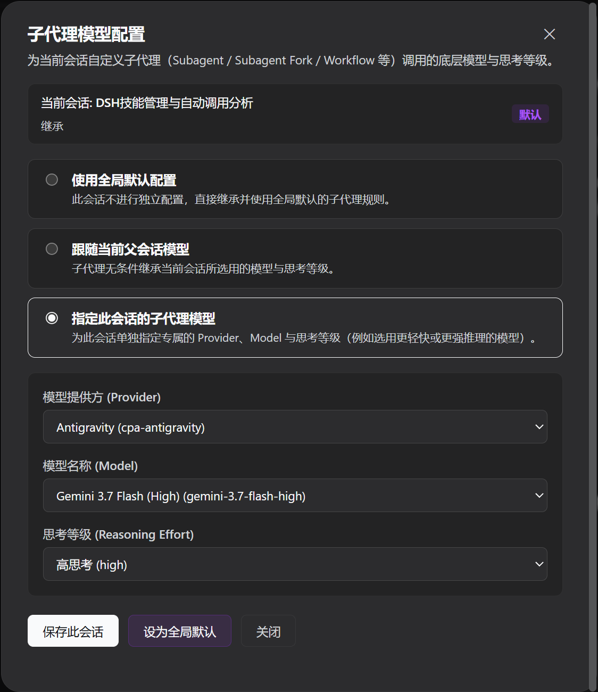

# dsh-subagent-custom-model

[English](README.md) | 中文

**DeepSeek Harness (DSH) Web GUI 子代理（Subagent）模型与思考等级动态配置插件。**

支持在 Web 界面中为各个会话独立或全局统一配置子代理（包含 `subagent`、`subagent_fork`、`workflow` 等）调用的底层模型（Provider / Model）与推理思考等级（Reasoning Effort），修改后即时生效，无需重启服务。



---

## 目录

- [功能特性](#功能特性)
- [使用指南](#使用指南)
  - [1. 打开配置弹窗](#1-打开配置弹窗)
  - [2. 模式说明与配置](#2-模式说明与配置)
  - [3. 保存与设为全局默认](#3-保存与设为全局默认)
  - [4. 清除会话覆盖（恢复默认）](#4-清除会话覆盖恢复默认)
- [从源码安装教程](#从源码安装教程)
  - [环境准备](#环境准备)
  - [第 1 步：获取源码](#第-1-步获取源码)
  - [第 2 步：安装依赖](#第-2-步安装依赖)
  - [第 3 步：构建插件](#第-3-步构建插件)
  - [第 4 步：安装到 DSH Web Profile](#第-4-步安装到-dsh-web-profile)
  - [第 5 步：启动并验证](#第-5-步启动并验证)
- [常用开发与维护命令](#常用开发与维护命令)
- [配置文件格式说明](#配置文件格式说明)
- [常见问题 (FAQ)](#常见问题-faq)
- [开源协议](#开源协议)

---

## 功能特性

- **侧边栏快捷入口**：位于 Web 界面左下角「设置」上方，直观显示当前会话生效模式与模型徽标，点击即可打开配置弹窗。
- **三层模式按需切换**：
  - **使用全局默认**：当前会话不作覆盖，直接沿用全局统一规则。
  - **跟随当前会话**：子代理无条件继承父会话选用的模型与思考等级。
  - **自定义子代理模型**：为当前会话单独指定模型提供方（Provider）、模型名称（Model）与思考等级（Reasoning Effort）。
- **即时动态生效**：配置保存后对下一次子代理调用立即生效，无需重启服务或刷新页面。

---

## 使用指南

### 1. 打开配置弹窗
在 DeepSeek Harness Web GUI 页面中，查看左侧边栏底部。在「设置（Settings）」上方可以看到 **「子代理模型」** 入口，点击即可打开配置对话框。

弹窗顶部展示：
- **生效范围**：当前正在配置的会话标题（或全局默认配置）。
- **生效模型**：当前该会话实际生效的模型、Provider 以及思考等级。
- **状态徽标**：`默认`（使用全局配置）、`继承`（跟随父会话）或 `自定义`（已指定具体模型）。

### 2. 模式说明与配置

| 模式 | 适用场景 | 说明 |
| :--- | :--- | :--- |
| **使用全局默认配置** | 大多数普通会话 | 该会话不设独立规则，全局默认改动时此会话会自动同步。 |
| **跟随当前父会话模型** | 主模型变更频繁，希望子代理始终对齐 | 子代理无条件继承父会话选用的 Provider、Model 与思考等级。 |
| **指定此会话的子代理模型** | 需对子任务精细化调优 | 自行选择 **模型提供方 (Provider)**、**模型名称 (Model)**，以及可选的 **思考等级 (Reasoning Effort)**。 |

#### 自定义模型配置步骤：
1. 选中 **「指定此会话的子代理模型」** 单选框。
2. 在下拉框中选择 **模型提供方 (Provider)**（如 deepseek、openai、anthropic 等）。
3. 在模型下拉框中选择具体的 **模型名称 (Model)**。
4. 若该模型支持推理档位调节，下方会自动展示 **思考等级 (Reasoning Effort)** 下拉菜单，按需选择档位（如 `high`、`medium`、`low` 等）。

### 3. 保存与设为全局默认

- **保存此会话 (Save for Session)**：
  - 点击底部的 **「保存配置 / 保存此会话」** 按钮。
  - 配置仅对当前会话生效，并在该会话后续触发 `subagent`、`workflow` 时立即应用。
- **设为全局默认 (Set as Global Default)**：
  - 若希望将当前所选的模式与模型作为以后所有新会话的默认规则，点击 **「设为全局默认」** 按钮。
  - 系统会将该配置更新至全局默认，并自动清理当前会话的独立覆盖项。

### 4. 清除会话覆盖（恢复默认）
若当前会话此前单独设置了自定义配置，操作区会出现 **「清除独立设置 (使用全局默认)」** 按钮。点击后即可恢复跟随全局默认规则。

---

## 插件安装

### 🚀 一行命令安装（推荐）

本仓库已配置 GitHub Actions 自动构建最小发布分支（`dist` 分支包含完整编译产物与元数据，无多余源码与依赖）。

直接运行以下命令即可一行安装，无需本地编译：

```sh
dsh plugin --profile web add github:u9521/dsh-subagent-custom-model#dist
```

> **提示**：安装完成后，启动或重启 Web 服务即可生效：
> ```sh
> dsh web
> ```

---

## 从源码安装教程（开发者）

以下是从源码构建并安装本插件到 DeepSeek Harness Web Profile 的完整步骤。

### 环境准备

在开始之前，请确保已安装以下基础环境：
- **Node.js**：`^22.19.0` 或 `>=24.0.0`
- **pnpm**：推荐 `pnpm >= 9.x`
- **DeepSeek Harness**：已安装 `dsh` CLI（`>= 0.1.0-rc.6`）

可以通过以下命令检查环境：
```sh
node -v
pnpm -v
dsh --version
```

### 第 1 步：获取源码

将插件代码克隆或下载到本地（建议放置在 `~/.dsh/plugins/` 目录）：

```sh
# 进入插件存放目录
mkdir -p ~/.dsh/plugins
cd ~/.dsh/plugins

# 克隆仓库（或复制源码至该目录）
git clone https://github.com/u9521/dsh-subagent-custom-model.git
cd dsh-subagent-custom-model
```

### 第 2 步：安装依赖

在插件根目录下使用 `pnpm` 安装构建所需依赖：

```sh
pnpm install
```

> **说明**：构建管线内置了 DSH 官方客户端打包预设（位于 `external/deepseek-harness/packages/client/`），无需下载完整的 DSH 源码仓库，直接执行 `pnpm install` 即可就绪。

### 第 3 步：构建插件

运行构建命令，编译 Host 端插件代码与 Web Client 前端 Bundle：

```sh
pnpm run build
```

构建成功后将生成 `lib/` 目录：
- `lib/index.js`：宿主端插件主入口（ESM）
- `lib/client.js`：Web 端前端插件 Bundle（CJS）
- `lib/types/`：TypeScript 类型声明文件

若仅需进行 TypeScript 类型检查，可执行：
```sh
pnpm run check
```

### 第 4 步：安装到 DSH Web Profile

使用 `dsh plugin` 命令将本插件注册到 Web Profile 中：

```sh
# 在插件根目录下执行：
dsh plugin --profile web add .
```

*也可以通过绝对路径进行安装：*
```sh
dsh plugin --profile web add ~/.dsh/plugins/dsh-subagent-custom-model
```

#### 验证安装状态
列出 Web Profile 中的已安装插件，确认包含 `@local/dsh-subagent-custom-model`：

```sh
dsh plugin --profile web list
```

### 第 5 步：启动并验证

启动 DSH Web GUI 服务：

```sh
dsh web
```

打开浏览器访问 DSH Web GUI（默认地址通常为 `http://localhost:3080`），在左侧边栏底部即可看到 **「子代理模型」** 图标与状态徽标，点击即可正常使用。

---

## 常用开发与维护命令

| 命令 | 描述 |
| :--- | :--- |
| `pnpm run build` | 完整构建（TypeScript 类型检查 + 生成 `lib/` 构建产物） |
| `pnpm run check` | 仅执行类型检查（`tsc --noEmit`），不生成文件 |
| `pnpm run fmt` | 使用 Prettier 自动格式化源码与配置文件 |
| `pnpm run fmt:check` | 检查代码格式规范 |
| `pnpm run sync` | 同步更新内置的 DSH 官方客户端打包预设（可附带 `--check` 或 `--yes`） |

---

## 配置文件格式说明

插件配置持久化保存在用户家目录下的 `~/.dsh/storages/subagent_model.json`。格式示例如下：

```json
{
  "default": {
    "mode": "custom",
    "provider": "deepseek",
    "model": "deepseek-chat"
  },
  "sessions": {
    "session-uuid-1": {
      "mode": "inherit"
    },
    "session-uuid-2": {
      "mode": "custom",
      "provider": "openai",
      "model": "gpt-4o-mini",
      "reasoningEffort": "medium"
    }
  }
}
```

- `default`：全局默认配置，支持 `inherit` 或 `custom`。
- `sessions`：按 Session ID 记录的独立覆盖配置。未在其中记录或设置为 `default` 模式的会话将自动沿用全局默认配置。

---

## 常见问题 (FAQ)

### Q1: 为什么部分模型没有显示「思考等级」下拉选择框？
**A**: 思考等级（Reasoning Effort）选项仅在模型元数据中声明了推理能力（`reasoning.efforts`）时才会动态渲染。如果选中的模型不支持调节推理等级（例如普通的纯对话模型），该选项会自动隐藏。

### Q2: 修改子代理模型后，需要重启 `dsh web` 吗？
**A**: 不需要。插件在宿主端挂载了实时请求拦截器，在 Web GUI 保存配置后，后端存储即时更新，当前会话下一次派生子代理（Subagent）时就会立即应用新的模型。

### Q3: 如何卸载或移除本插件？
**A**: 可以通过 DSH CLI 随时从 Web Profile 中移除：
```sh
dsh plugin --profile web remove @local/dsh-subagent-custom-model
```

---

## 开源协议

本项目基于 [MIT License](LICENSE) 授权开源。
